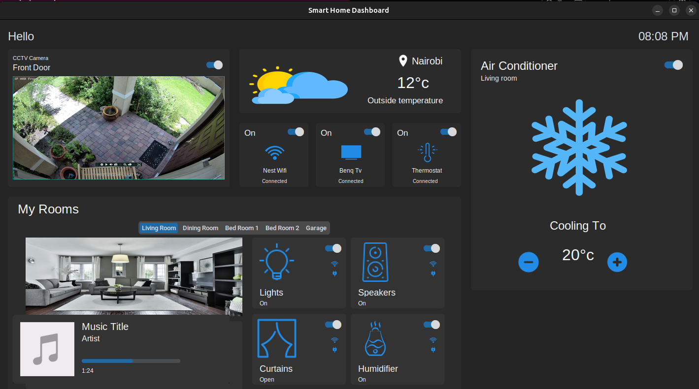

# Smart Home Dashboard



## Description

**Smart Home Dashboard** is a CustomTkinter-powered desktop application that provides an interactive interface for managing various smart home features. It includes modules for controlling devices like lights, thermostats, air conditioners, TVs, and more — all in a visually structured and modular Python GUI. The app is fully extensible and uses a component-based structure for ease of development and scalability.

---

# Group : `midnight-deadlines`

## 👥 Members & Modules

Each member was responsible for a module and contributed their function into the shared `PrintQueueManager` class:

| Name              | No.           | Module                             | Contribution                                                                                   |
| ----------------- | ---------------- | ---------------------------------- | ---------------------------------------------------------------------------------------------- |
| **Richie Mwangi** | 189293 | Music player queue              | Built the music player (`music_player.py`) with a queue or predefined songs.        |
| **Ernest Njoroge**  | 190023 | Camera widget            | Implemented the CCTV widget section, its just a for display at the moment (`camera_section.py`).     |
| **Lynn Ivy** | 175793 | Devices widget and database handling               | Developed the user database system and also the GUI for devices (`device_section.py`).               |
| **Joseph Kinyuru**   | 167600 | Rooms widget     | Implemented the rooms widget with different tabs for various rooms and devices within them.  (`room_tabs.py`). |
| **Jean Njoroge**  | 187923 | Weather widget | Developed the mock weather widget that should keep track of current weather updates (`weather_section.py`).     |
| **Laureen Angie**  | 191876 | Air conditioning widget          | Implemented the air conditioning widget that handles the overall temp of the house. (`air_conditioner_section.py`).          |

---

## 📁 Project Structure

```

├── main.py
├── README.md
├── requirements.txt
├── semester_project_brief.md
├── users.db
├── utils
│   ├── events.py
│   ├── helpers.py
│   └── __pycache__
├── widgets
│   ├── air_conditioner_section.py
│   ├── camera_section.py
│   ├── device_section.py
│   ├── music_player.py
│   ├── room_tabs.py
│   └── weather_section.py
└── images/
    .....

```

---

## Getting Started

Follow these steps to set up and run the Smart Home Dashboard locally.

### Prerequisites

- Python 3.10+
- `pip` (Python package manager)

### Installation

1. **Clone the repository:**

    ```bash
    git clone https://github.com/ICS-2025-GROUP-D/dsa-sem-project-midnight-deadlines.git
    cd dsa-sem-project-midnight-deadlines
    ```

2. **Create a virtual environment:**

    ```bash
    python3 -m venv venv
    ```

3. **Activate the environment:**

    - On **Linux/macOS**:

        ```bash
        source venv/bin/activate
        ```

    - On **Windows**:

        ```bash
        venv\\Scripts\\activate
        ```

4. **Install required dependencies:**

    ```bash
    pip install -r requirements.txt
    ```

5. **Run the application:**

    ```bash
    python3 main.py
    ```

6. **(Optional - After closing dashboard) Deactivate the virtual environment:**

    ```bash
    deactivate
    ```